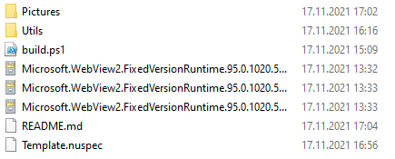

## Nuget packages for Microsoft WebView2 Fixed Runtime Distribution

### Nuget packages:
| Platform | Architecture | Package Name | Version | Downloads
| --- | --- | --- | --- | --- |
| Windows | X86 | WebView2.Runtime.X86 | [](https://www.nuget.org/packages/WebView2.Runtime.X86/) | [](https://www.nuget.org/packages/WebView2.Runtime.X86/) |
| Windows | X64 | WebView2.Runtime.X64 | [](https://www.nuget.org/packages/WebView2.Runtime.X64/) | [](https://www.nuget.org/packages/WebView2.Runtime.X64/) |
| Windows | ARM64 | WebView2.Runtime.ARM64 | [](https://www.nuget.org/packages/WebView2.Runtime.ARM64/) | [](https://www.nuget.org/packages/WebView2.Runtime.ARM64/) |
| Windows | Any | WebView2.Runtime.AutoInstaller | [](https://www.nuget.org/packages/WebView2.Runtime.AutoInstaller/) | [](https://www.nuget.org/packages/WebView2.Runtime.AutoInstaller/) |

### Runtime packages usage example:
1) Install via nuget selected architecture package.
```
Install-Package WebView2.Runtime.X64
```
2) Make sure what in you project appears folder WebView2 and all files marked as "Copy To Output".
3) Initialize webview2 before usage, path must be to WebView2 directory. In most cases it must be in application directory.
``` C#
var webView = new WebView2() { Dock = DockStyle.Fill };
await webView.EnsureCoreWebView2Async(await CoreWebView2Environment.CreateAsync(Path.Combine(AppDomain.CurrentDomain.BaseDirectory, "WebView2")));
Controls.Add(webView);
webView.CoreWebView2.Navigate("https://nuget.org/");
```

### Automate runtime installer example:
You can use package WebView2.Runtime.AutoInstaller to check current WebView2 runtime installed status and automate install it.

This type of installation requires running the program as an administrator (or installer will request them independently) and ethernet connection.

Source of this library [you can find here](https://github.com/ProKn1fe/WebView2.Runtime/tree/master/WebView2.Runtime.AutoInstaller).
1) Install via nuget.
```
Install-Package WebView2.Runtime.AutoInstaller
```
2) Use
``` C#
// Check and install if not installed
await WebView2AutoInstaller.CheckAndInstallAsync();
// Only check, return true or false
await WebView2AutoInstaller.CheckAndInstallAsync(true);
// Show runtime installer window
await WebView2AutoInstaller.CheckAndInstallAsync(false, false);
// Set custom path to runtime installer (maybee you put it into application resources).
await WebView2AutoInstaller.CheckAndInstallAsync(false, false, "path");
```

### Samples

You can found samples in [Samples](https://github.com/ProKn1fe/WebView2.Runtime/tree/master/Samples) directory.
Also check official microsoft edge [samples repository](https://github.com/MicrosoftEdge/WebView2Samples).

### Build nupkg:
1) Clone repository.
2) Run build.ps1 and wait.
3) Or if you want to build with different WebView2 version download .cab files from fixed version section and put in build directory (as in picture) - https://developer.microsoft.com/en-us/microsoft-edge/webview2/#download-section.



### Used tools:
1) [nuget.exe](https://www.nuget.org/downloads) - nuget package builder.
2) expand.exe - tool for unpack .cab files (taked from windows 10 system32 directory).
